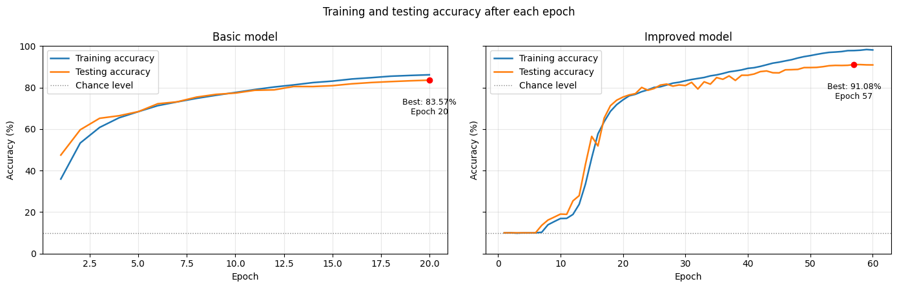

# CIFAR-10 Classification with a Dynamically Weighted Multi-Branch CNN

  <b>A PyTorch image-classification project exploring input-dependent convolutional branch weighting on CIFAR-10.</b>

## Quick Links

  <a href="notebooks/CIFAR10_CNN.ipynb">Modelling Notebook</a> •
  <a href="results/README.md">Evaluation Results</a> •
  <a href="notebooks/architecture%20diagram.png">Architecture Diagram</a> •
  <a href="https://github.com/sarahnish/portfolio">Project Portfolio</a>

---

## At a Glance

| Dataset | Training Images | Test Images | Baseline Accuracy | Improved Accuracy |
|---|---:|---:|---:|---:|
| **CIFAR-10** | **50,000** | **10,000** | **83.57%** | **91.08%** |

> **+7.51 percentage-point improvement in best test accuracy**

---

## Overview & Architecture

Standard convolutional layers apply a fixed learned transformation to every input.

This project explores a dynamic multi-branch architecture where several convolutional branches process the same feature map in parallel. Their outputs are combined using input-dependent coefficients generated from the incoming feature representation.

  

### Dynamic Block Workflow

1. **Channel Summarisation:** Spatially average each input channel across the feature map.
2. **Coefficient Generation:** Pass the resulting channel-summary vector through a linear fully connected layer to generate one coefficient for each branch.
3. **Parallel Processing:** Send the same input feature map through multiple convolutional branches.
4. **Weighted Fusion:** Multiply each branch output by its corresponding input-dependent coefficient and sum the weighted outputs.

### Network Capacity

The improved model stacks four dynamic blocks with increasing channel capacity:

**3 → 64 → 128 → 256 → 512 channels**

Max pooling progressively reduces spatial dimensions:

**32×32 → 16×16 → 8×8 → 4×4**

[View full architecture diagram →](notebooks/architecture%20diagram.png)

---

## Key Performance Findings

### 1. The Improved Configuration Achieved +7.51 pp

  

| Model | Best Test Accuracy | Epochs Trained | Best Epoch |
|---|---:|---:|---:|
| **Baseline CNN** | **83.57%** | 20 | 20 |
| **Improved CNN** | **91.08%** | 60 | **57** |

The improved configuration increased best test accuracy by **7.51 percentage points** over the baseline.

[View full evaluation results →](results/README.md)

### 2. Generalisation & Best Checkpoint Selection

- **Peak Checkpoint:** The improved model reached **91.08% test accuracy at epoch 57**, before falling slightly to **90.91% at epoch 60**.
- **Generalisation Gap:** At the best checkpoint, training accuracy was **97.83%** compared with **91.08%** test accuracy, giving a **6.75 percentage-point gap**. This suggests moderate overfitting despite the additional regularisation used in the improved model.

### 3. Per-Class Performance

| Strongest Classes | Accuracy | Most Difficult Classes | Accuracy |
|---|---:|---|---:|
| **Car** | **95.90%** | **Cat** | **79.50%** |
| **Truck** | **95.20%** | **Dog** | **84.90%** |
| **Frog** | **94.50%** | — | — |
| **Ship** | **94.20%** | — | — |

**Mean per-class accuracy: 91.08%**

Cats and dogs were the hardest classes for the model.

At CIFAR-10's small **32×32 pixel resolution**, visually similar animal categories can share shapes, textures and backgrounds, making them more difficult to distinguish.

---

## Training Hyperparameters

| Setting | Baseline CNN | Improved Dynamic CNN |
|---|---|---|
| **Initial Learning Rate** | 0.03 | 0.10 |
| **Learning-Rate Schedule** | Cosine annealing | Cosine annealing |
| **Optimiser** | SGD with Nesterov momentum | SGD with Nesterov momentum |
| **Momentum** | 0.9 | 0.9 |
| **Weight Decay** | 5e-4 | 5e-4 |
| **Batch Size** | 128 | 128 |
| **Gradient Clipping** | Max norm 2.0 | Max norm 2.0 |
| **Dropout** | None | 0.5 |
| **Label Smoothing** | None | 0.1 |
| **Epoch Budget** | 20 | 60 |

Both models also used random-crop and horizontal-flip augmentation and CIFAR-10 normalisation.

---

## What Changed?

The improved configuration retained the same dynamic branch-weighting mechanism while introducing several changes:

- increased network depth and width
- additional branches in deeper blocks
- batch normalisation
- a hidden fully connected output layer
- dropout
- label smoothing
- a higher initial learning rate
- a longer training schedule

Because several changes were introduced together, the **7.51 percentage-point improvement cannot be attributed to one individual technique**.

The result instead shows that the final improved configuration performed better as a whole.

---

## Methodological Limitations

### Ablation Isolation

Several architectural and training changes were introduced simultaneously, so their individual contributions cannot be isolated.

A stronger follow-up experiment would introduce one change at a time through controlled ablation studies.

### Training Budget

The baseline was trained for **20 epochs**, while the improved model was trained for **60 epochs**.

The baseline was still improving when training ended, so a longer baseline training schedule may have produced a stronger result.

### Evaluation Design

Model comparison and best-checkpoint selection were conducted using the test partition.

In a larger research project, I would use a dedicated validation split for model selection and hyperparameter tuning while reserving the test set for final evaluation.

### Single Random Seed

The experiment used one random seed, so the reported results do not capture variation between repeated training runs.

---

## Tech Stack

| Category | Tools & Technologies |
|---|---|
| **Language** | Python |
| **Deep Learning** | PyTorch |
| **Computer Vision** | torchvision |
| **Data & Numerical Computing** | NumPy |
| **Visualisation** | Matplotlib |
| **Environment** | Jupyter Notebook · Google Colab |
| **Version Control** | Git · GitHub |

---

## What I Learned

This project gave me practical experience with:

- building custom neural-network components in PyTorch
- working with reusable `nn.Module` classes
- implementing input-dependent convolutional branch weighting
- training and evaluating CNNs on image data
- comparing baseline and improved model configurations
- tracking and restoring the strongest checkpoint
- analysing training curves and generalisation gaps
- evaluating performance at class level
- recognising limitations in experimental design

